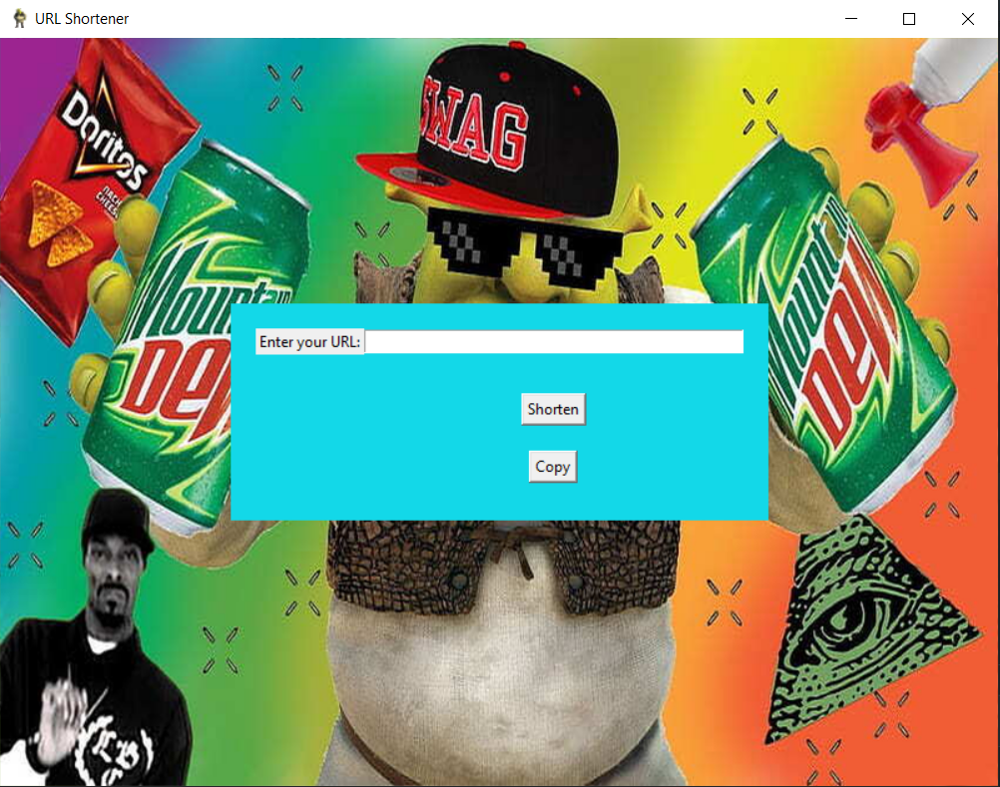
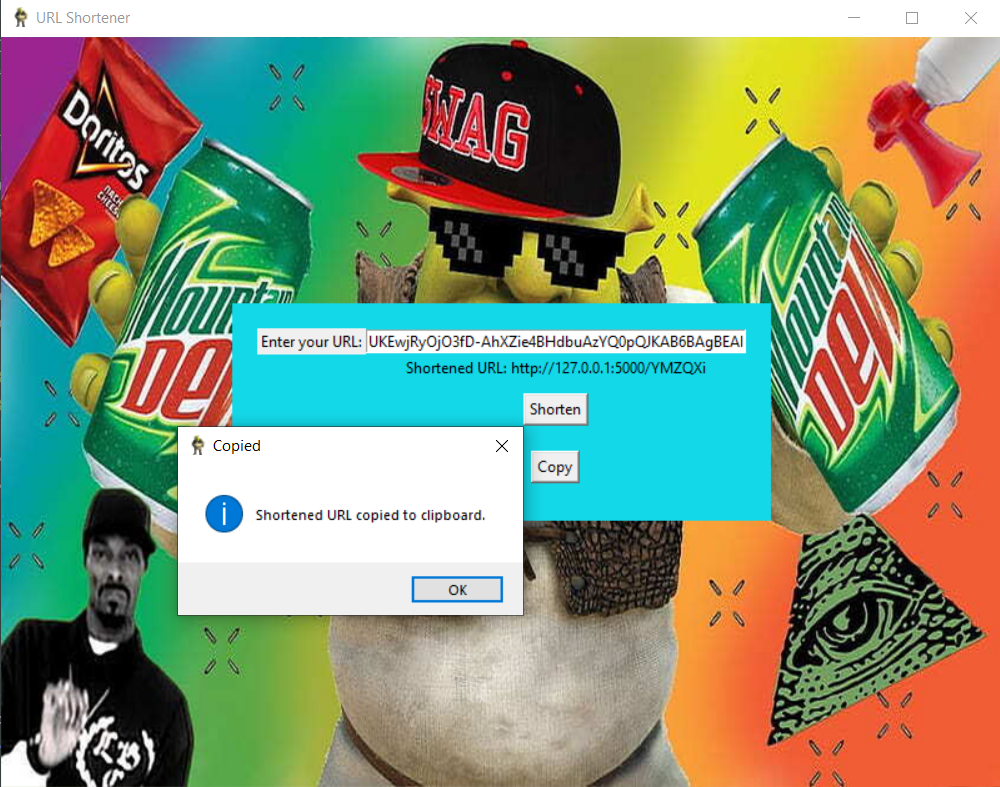

# URL_Shortener
┬┴┬┴┤ ͜ʖ ͡°) ├┬┴┬┴

GUI:
1. Run "python url_shortener.py"  #flask 
2. Open another terminal
3. Run "python gui.py"

Web App:
1. Run "python url_shortener.py"
2. Click output link or open to web server ip

